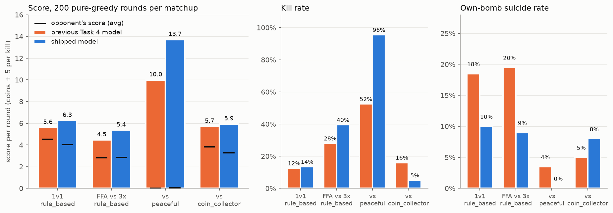

<div align="center">
    <h1> Reinforcement Learning Agents in Bomberman </h1>
    <h3></h3>
</div>

Two agents, built on deliberately different function-approximation architectures (per the
assignment's requirement to develop two or more different models): **`linear_agent`**
(`Q(s,a) = weights . features(s,a)`, trained online via semi-gradient TD(0)) and **`tree_agent`**
(`Q(s,a) = model.predict(features(s,a))`, a tree ensemble trained via Fitted Q-Iteration). Both
are developed task-by-task, following the assignment's four subgoals; each section below
documents one task for one agent, with the commands to reproduce it and the validated result.

## linear_agent

Represents `Q(s,a)` as a dot product between a weight vector and a small set of hand-crafted,
interpretable state-action features. No neural network, replay buffer, or target network --
`self.weights` (see `callbacks.py`) is the entire model. Complete through all four tasks; full
narrative detail (every fix attempted, including reverted ones) lives in
`report/report1_body.typ` through `report/report4_body.typ`.

### Task 1: collecting coins

train the linear agent:
```bash
uv run main.py play --agents linear_agent --train 1 --scenario coin-heaven --no-gui --n-rounds 1000
```

evaluate the linear agent:
```bash
uv run main.py play --agents linear_agent --scenario coin-heaven # single run 
uv run main.py play --agents linear_agent --scenario coin-heaven --no-gui --n-rounds 200 # multiple runs
```

### Task 2: clearing crates

The agent lives entirely in three files: `agent_code/linear_agent/features.py`, `train.py`,
`callbacks.py`. To reproduce it in a fresh checkout, drop these three files into
`agent_code/linear_agent/` of this repository (overwriting the Task 1 versions) -- no other
files are needed, and no pretrained model needs to be shipped alongside them.

train the linear agent (starts from scratch every time `--train 1` is passed, regardless of any
existing `linear-model.pt`):
```bash
uv run main.py play --agents linear_agent --train 1 --scenario loot-crate --no-gui --n-rounds 50000
```

**50,000 rounds is what the reported result below was trained and validated on** (commit-gap
and escape-safety checked stable across three independent runs at 5,000 / 20,000 / 50,000
rounds). Training takes roughly 1-4 hours depending on machine and how large the per-run log
files grow (see note below); 20,000 rounds already gets close and is a reasonable choice if
short on time.

evaluate the linear agent (loads `linear-model.pt`, no exploration, no further training):
```bash
uv run main.py play --agents linear_agent --scenario loot-crate # single run
uv run main.py play --agents linear_agent --scenario loot-crate --no-gui --n-rounds 200 --save-stats results.json # multiple runs
```

Expected result on `loot-crate` (`CRATE_DENSITY = 0.75`, 50 coins hidden under crates, 400 steps
per round), averaged over a 200-round evaluation:

| Metric | Value |
|---|---|
| Coins/round | ~46.7 / 50 (93%) |
| Self-kill rate | 0% |
| Full-board-clear rate | ~16% of rounds |

**Note on train vs. eval behavior:** the agent's escape-routing (which safe tile it retreats to
after dropping a bomb, when multiple equally-short options exist) is intentionally different
during training vs. evaluation -- training always uses the simpler routing the saved weights
were originally validated under, while evaluation uses an improved, target-aware routing that
noticeably shortens the average time to clear a board. This is automatic (gated on `self.train`
in `features.py`'s `state_features`) and requires no action from you; it's mentioned here only
so the difference isn't mistaken for a bug if you go looking at the code.

**Note on training speed:** two files grow large over a long run
(`agent_code/linear_agent/metrics/training_log.csv` and `agent_code/linear_agent/logs/linear_agent.log`,
both per-step logs) and have been observed to measurably slow training down past ~20,000 rounds
on some machines. If a run seems to be slowing down significantly, deleting those two files
mid-run is safe (the process keeps writing to them regardless; only their on-disk footprint
changes) and has been observed to restore normal speed.

### Task 3: hunting opponents

train against either opponent (5,000 rounds is what the shipped model was trained/validated on):
```bash
uv run main.py play --agents linear_agent peaceful_agent --train 1 --scenario classic --no-gui --n-rounds 5000
uv run main.py play --agents linear_agent coin_collector_agent --train 1 --scenario classic --no-gui --n-rounds 5000
```

evaluate:
```bash
uv run main.py play --agents linear_agent peaceful_agent --scenario classic --no-gui --n-rounds 200 --save-stats results.json
uv run main.py play --agents linear_agent coin_collector_agent --scenario classic --no-gui --n-rounds 200 --save-stats results.json
```

Expected result of the currently shipped model (`linear-model.pt`, trained against `rule_based_agent`
-- see Task 4 below; it also handles Task 3's opponents well as an emergent side effect, see
`report3_body.typ` / `report4_body.typ`), averaged over 200 evaluation rounds:

| Opponent | Score (ours / theirs) | Our kills | Our suicides |
|---|---|---|---|
| `peaceful_agent` | 2550 / 4 | 154 (77%) | 5 (2.5%) |
| `coin_collector_agent` | 1299 / 654 | 29 (14.5%) | 31 (15.5%) |

`coin_collector_agent`'s stalemate rate (rounds that end with the board fully cleared but neither
agent finishing the other off) is a known, documented limitation -- see the "Open Questions"
section of `report3_body.typ` for the full investigation and every fix attempted.

### Task 4: holding your own against rule_based_agent

train:
```bash
uv run main.py play --agents linear_agent rule_based_agent --train 1 --scenario classic --no-gui --n-rounds 5000
```

evaluate (1-vs-1, and the 4-player free-for-all used to check generalization):
```bash
uv run main.py play --agents linear_agent rule_based_agent --scenario classic --no-gui --n-rounds 200 --save-stats results.json
uv run main.py play --agents linear_agent rule_based_agent rule_based_agent rule_based_agent --scenario classic --no-gui --n-rounds 200 --save-stats results.json
```

Expected result of the shipped model, averaged over 200 evaluation rounds:

| Matchup | Score (ours / theirs) | Our kills | Our suicides |
|---|---|---|---|
| 1v1 vs `rule_based_agent` | 1190 / 825 | 23 (11.5%) | 41 (20.5%) |
| 4-player FFA (ours vs 3x `rule_based_agent`) | 826 vs ~519 avg | 29 (14.5%) | 46 (23%, vs. ~42.5% avg for the three `rule_based_agent` copies) |

The 1v1 result is validated across an independent 5-seed training sweep (suicides 17-22%,
score 1220-1280 vs. 712-794 across all 5 seeds), not just this single run -- see
`report4_body.typ` for the full sweep table and every fix attempted (including several that
were tried and reverted after regressing other opponents).

## tree_agent

Represents `Q(s,a)` as the output of a tree-ensemble regressor (`sklearn.ensemble.ExtraTreesRegressor`,
50 trees, `min_samples_leaf = 5`) over a 16-dimensional hand-crafted state-action feature vector,
trained by Fitted Q-Iteration (Ernst, Geurts & Wehenkel, 2005): transitions accumulate in a
replay buffer of 100,000 transitions (250 full rounds) and every 25 rounds the whole buffer is
batch-refit into a fresh ensemble over 3 sweeps, each sweep bootstrapping its targets
`r + 0.95 * max_a Q(s', a)` off the previous sweep's model. As in `linear_agent`, the action is
not a separate input: `phi(s, .)` is evaluated once per candidate action and the model predicts
one scalar per row. The agent lives entirely in three files (`agent_code/tree_agent/features.py`,
`train.py`, `callbacks.py`) plus the shipped model `tree-model.pt`; `agent_code/tree_agent/tests/`
holds optional unit tests (see Metrics).

**One model ships for all four tasks.** `tree-model.pt` was trained for 5,000 rounds against
`rule_based_agent` on `classic` and is used unchanged on every scenario below.

### What the agent computes each step

Everything that is a property of the *game* rather than of the learner is deterministic code in
`features.py`, shared in spirit with `linear_agent`:

- **Danger and escape.** Blast simulation for every bomb, the tiles lethal this step, and a
  bounded BFS for the shortest route out of a blast. `BOMB` is structurally invalid unless such a
  route exists after the drop (accounting for a retaliatory bomb from a bomb-capable opponent
  within radius 1, or 2 once that opponent has been seen bombing this round). During an escape
  window the verified escape direction is forced. The escape search may cross another bomb's
  blast while that bomb's timer allows, treats the tiles an opponent could step into as blocked
  at drop time (and as a conservative first pass with fallback while escaping), and does not end
  an escape on a tile a known-bombing, armed opponent's bomb would cover
  (`ESCAPE_TIMING_AWARE`, `ESCAPE_AVOIDS_OPPONENT_REACH`, `ESCAPE_AVOIDS_PLAUSIBLE_OPPONENT_BLAST`).
- **A scored navigation target** (`_select_target`). Every visible coin scores
  `COIN_TARGET_VALUE - 0.5 * distance` (3.0 alone on the board, 9.0 while an opponent is alive --
  contested coins are first come, first served) and every free tile a bomb would clear at least
  one crate from -- and could be escaped from -- scores `1.5 * yield - 0.5 * distance - 1.0`.
  Crates inside an active blast count as already gone. The best candidate is *the* target the
  distance features, the shaping potentials and the escape tie-break refer to; opponents are not
  targets (`OPPONENTS_AS_TARGETS = False`) -- hunting is driven by the opponent features and
  rewards below.
- **The safety mask** (`callbacks.py`). Both exploration and the greedy argmax skip invalid moves,
  moves into a blast, and `BOMB` next to a bomb-capable opponent (radius 1 / 2 as above); WAIT
  is always available. If nothing is fully safe the mask falls back to validity only.

The learned part is `argmax_a Q(s,a)` over the masked actions, with `Q` fit on these features:

| index | feature | index | feature |
|---|---|---|---|
| 0 | `moves_to_coin` (toward a coin target) | 8 | `moves_to_crate` (toward a bomb-spot target) |
| 1 | `valid` | 9 | `moves_to_opponent` |
| 2 | `is_wait` | 10 | `bomb_hits_opponent_if_bomb` |
| 3 | `is_bomb` | 11 | `target_distance_after` (from the tile the action lands on) |
| 4 | `moves_into_avoidable_danger` | 12 | `target_distance_delta` (-1 toward, +1 away, 0) |
| 5 | `escape_exists_if_bomb` | 13 | `yield_at_landing_tile` (crates a bomb there would clear) |
| 6 | `crate_count_if_bomb` | 14 | `bomb_cooldown` (steps until `BOMB` is available again) |
| 7 | `escape_correct_move` | 15 | `target_is_coin` |

### Training

`--train 1` always starts from scratch. Exploration is epsilon-greedy over the safety mask with
`epsilon = max(0.05, 0.997^round)`. Rewards per step: `COIN_COLLECTED +1`, `COIN_FOUND +2`,
`CRATE_DESTROYED +1.5`, `KILLED_OPPONENT +10`, `KILLED_SELF -10`, `GOT_KILLED -10`,
`BOMB_DROPPED -0.05`, `WAITED -0.15`, `INVALID_ACTION -0.1`; a direct `+5` on a `BOMB` that
will hit at least one crate (`CRATE_HIT_BONUS`) or an opponent's current tile
(`OPPONENT_HIT_BONUS`); a movement credit of `+3` for a step toward the navigation target and
`-3` for a step away (`MOVE_TOWARD_BONUS`, antisymmetric so a two-tile oscillation nets zero);
and potential-based shaping (Ng, Harada & Russell 1999) toward the coin or bomb-spot target,
toward safety while inside a blast, and toward the nearest opponent (scaled by 0.2). The
training-time escape tie-break is target-aware (`TARGET_AWARE_ESCAPE_IN_TRAINING = True`), the
same as at evaluation. Every 250 rounds a checkpoint is written to `checkpoints/model_round_N.pt`
(`CHECKPOINT_INTERVAL`, gitignored).

Three findings shape the shipped configuration; the tools behind them are listed under Metrics:

- **Training length does not matter past the first few hundred rounds.** Pure-greedy evaluation
  of 80 checkpoints from two independent 10,000-round runs against `rule_based_agent` shows a
  flat, noisy band from round 250 to 10,000 (score margin +0.4 to +3.4 per round, no trend); the
  shipped model sits at the top of that band, and the best checkpoint re-evaluated on paired
  boards is within selection noise of it (+2.69 vs +2.25 per round in 1v1, identical in the
  free-for-all). Each refit is a fresh ensemble on the last 250 rounds of data, so a later model
  is not a "more trained" one.
- **Gradient boosting was measured and not adopted.** On one fixed replay buffer and identical
  Bellman targets, `HistGradientBoostingRegressor` fits no better than ExtraTrees (held-out RMSE
  3.24-3.29 vs 3.22), agrees less with the shipped policy, shows the same Q-inflation over 20
  sweeps and predicts 4-12x slower; monotone constraints make the fit worse (4.79).
- **Training-time metrics are not evaluation metrics.** Under the 0.05 exploration floor a
  frozen greedy policy still scores; every number below is a pure-greedy (`epsilon = 0`)
  evaluation with `--save-stats`.

**Model compatibility:** `callbacks.setup` checks the loaded model's feature count against
`N_FEATURES` and raises a `ValueError` on a mismatch instead of playing with a mismatched
model. `TREE_AGENT_MODEL_PATH=<file>` evaluates a specific model file (e.g. a checkpoint);
`TREE_AGENT_INIT_MODEL=<file>` starts a training run from an existing model and
`TREE_AGENT_EPSILON=<rate>` pins its exploration rate; `REPLAY_DUMP_PATH=<file>` pickles the
replay buffer on every refit. All four are analysis hooks and unset in normal use.

### Task 1: collecting coins

evaluate (loads `tree-model.pt`, no exploration, no further training):
```bash
uv run main.py play --agents tree_agent --scenario coin-heaven # single run
uv run main.py play --agents tree_agent --scenario coin-heaven --no-gui --n-rounds 200 --save-stats results.json # multiple runs
```

| Metric | Value |
|---|---|
| Coins/round | 50.0 / 50 (100%) |
| Invalid actions | 0 |
| Avg. steps/round | 127.9 (30-round evaluation) |

The shipped Task 4 model is used as is; a dedicated Task 1 model (2,000 rounds on `coin-heaven`,
the `REFIT_INTERVAL x N_ESTIMATORS` sweep behind it under `metrics/tree_agent/task1/`) reached
the same 50.0/50 at 124.1 steps/round over 200 rounds. `linear_agent`: 48.2/50.

### Task 2: clearing crates

evaluate:
```bash
uv run main.py play --agents tree_agent --scenario loot-crate # single run
uv run main.py play --agents tree_agent --scenario loot-crate --no-gui --n-rounds 200 --save-stats results.json # multiple runs
```

Expected result on `loot-crate` (`CRATE_DENSITY = 0.75`, 50 coins hidden under crates, 400 steps
per round), 200-round pure-greedy evaluation of the shipped model:

| Metric | Value |
|---|---|
| Coins/round | 49.76 / 50 (99.5%) |
| Full-board clears (all 50 coins) | 196 / 200 (98%) |
| Round length | median 351 steps -- a round ends once the board is clear |
| Bombs/round | 32.9 |
| Self-kill rate | 0% |
| Invalid actions | 0 across all 200 rounds |

`linear_agent`: 46.7/50 with ~16% full clears. A model trained on `loot-crate` alone
(`uv run main.py play --agents tree_agent --train 1 --scenario loot-crate --no-gui --n-rounds 1500`)
reaches 49.95/50 with 197/200 full clears; it is archived as
`results/tree_agent/task2/tree_model_task2_routing.pt` but not shipped, since the Task 4 model
covers the scenario. `metrics/tree_agent/task2/trace_step_budget.py` shows where a round's steps
go (8.9 steps per bomb cycle against a physical floor of ~7).

### Task 3: hunting opponents

evaluate (`classic`: 9 coins, 75% crates, one opponent; score = coins + 5 per kill):
```bash
uv run main.py play --agents tree_agent peaceful_agent --scenario classic --no-gui --n-rounds 200 --save-stats results.json
uv run main.py play --agents tree_agent coin_collector_agent --scenario classic --no-gui --n-rounds 200 --save-stats results.json
```

| Opponent | Score (ours / theirs) | Our kills | Our suicides |
|---|---|---|---|
| `peaceful_agent` | 2742 / 7 | 191 (95.5%) | 0 (0.0%) |
| `coin_collector_agent` | 1187 / 656 | 10 (5.0%) | 16 (8.0%) |

Dedicated per-opponent models (5,000 rounds each, `--train 1` against the respective opponent)
do not beat the shipped model -- 2653 / 13 with 174 kills vs `peaceful_agent`, 1158 / 657 with
14 kills vs `coin_collector_agent` -- and are archived as
`results/tree_agent/task3/tree_model_{peaceful,collector}_v2.pt`.

### Task 4: holding your own against rule_based_agent

train (this is the shipped model's training run):
```bash
uv run main.py play --agents tree_agent rule_based_agent --train 1 --scenario classic --no-gui --n-rounds 5000
```

evaluate (1v1, and the 4-player free-for-all):
```bash
uv run main.py play --agents tree_agent rule_based_agent --scenario classic --no-gui --n-rounds 200 --save-stats results.json
uv run main.py play --agents tree_agent rule_based_agent rule_based_agent rule_based_agent --scenario classic --no-gui --n-rounds 200 --save-stats results.json
```

| Matchup | Score (ours / theirs) | Our kills | Our suicides |
|---|---|---|---|
| 1v1 vs `rule_based_agent` | 1251 / 810 | 27 (13.5%) | 20 (10.0%) |
| 4-player FFA vs 3x `rule_based_agent` | 1073 vs ~570 avg | 79 (39.5%) | 18 (9.0%); the three `rule_based_agent` copies: ~43% |



On fixed boards (`--seed 2`, 200 rounds): 1v1 1267 / 818, FFA 1142 vs 556. Own-bomb deaths
against `rule_based_agent` are classified by `metrics/tree_agent/task4/death_trace.py`; the
remaining ones are mostly an opponent bomb cutting an escape route that existed at drop time.
The model is archived as `results/tree_agent/task4/tree_model_rulebased_v2.pt`; the best
checkpoint of the 10,000-round runs, `tree_model_rulebased_v2_ckpt7250.pt`, is kept alongside it
for reference (1v1 1298 / 759 on the same fixed boards, FFA 1129 vs 548).

## Metrics: reproducing our results

Every sweep, trace, and plot behind the numbers in this README and in the report lives under
`metrics/`, organized first by agent, then by task:

```
metrics/
├── linear_agent/
│   ├── plot_metrics.py        # generic per-run training-log plotting utility
│   ├── task1/                 # coin-heaven hyperparameter sweep (alpha x gamma grid)
│   ├── task2/                 # loot-crate reward-magnitude sweeps and self-kill investigation
│   ├── task3/                 # peaceful_agent / coin_collector_agent 5-seed sweeps + trace_*.py death/stalemate scripts
│   └── task4/                 # rule_based_agent 5-seed sweep + trace_*.py death/escape scripts
└── tree_agent/
    ├── refit_interval_sweep.py  # re-sweep of REFIT_INTERVAL against Task 2's own workload (negative result)
    ├── task1/                   # coin-heaven hyperparameter sweep (REFIT_INTERVAL x N_ESTIMATORS grid)
    ├── task2/                   # step-budget trace, routing-revision figures, EXTRA_CRATE_BONUS ablation figure
    ├── task3/                   # OPPONENT_POTENTIAL_SCALE regression-fix figure + training learning curve
    └── task4/                   # death classifier, checkpoint selection, training-trend and regressor-comparison plots, earlier Task 4 figures
```

Each `plot_*.py` script writes its rendered figures into the matching `results/<agent>/taskN/`
folder (mirroring the `metrics/` layout 1:1):

```
results/
├── linear_agent/
│   ├── task1/   # figures referenced in report1_body.typ
│   ├── task2/   # figures referenced in report2_body.typ
│   ├── task3/   # figures referenced in report3_body.typ
│   └── task4/   # figures referenced in report4_body.typ
└── tree_agent/
    ├── task1/   # figures referenced in report_tree_task1_body.typ
    ├── task2/   # figures referenced in report_tree_task2_body.typ
    ├── task3/   # figures, per-opponent eval JSONs, and archived per-opponent models
    ├── task4/   # figures, eval JSONs, the archived shipped model, checkpoint evaluations, the replay buffer of the regressor study
    └── refit_interval_sweep/  # per-config training JSONs from the REFIT_INTERVAL re-sweep
```

`results/` itself is gitignored (regenerable, grows large), but the `results/<agent>/taskN/`
figure PNGs specifically are force-added and tracked, since they're the actual images the report
embeds. Every other script writes its own `--save-stats` JSON / CSV / raw training-log output
elsewhere under `results/` (untracked, regenerable by rerunning), and all scripts are self-locating
(resolving the repository root from their own file path, not the working directory you invoke them
from) so they can be run directly from a fresh clone.

### linear_agent

**Task 1** -- hyperparameter sweep behind the Task 1 heatmaps/learning curves:
```bash
uv run metrics/linear_agent/task1/sweep.py        # ~2000 rounds x 16 (alpha, gamma) configurations
uv run metrics/linear_agent/task1/plot_sweep.py   # renders the figures referenced in report1_body.typ
```

**Task 2** -- reward-magnitude sweeps and the self-kill investigation:
```bash
uv run metrics/linear_agent/task2/reward_sweep.py        # first reward-magnitude sweep
uv run metrics/linear_agent/task2/reward_sweep2.py       # follow-up sweep (resumable via reward_sweep2_resume.py)
uv run metrics/linear_agent/task2/killed_self_sweep.py   # self-kill-rate-focused sweep
uv run metrics/linear_agent/task2/plot_task2.py          # renders the figures referenced in report2_body.typ
uv run metrics/linear_agent/task2/plot_report_extras.py  # supplementary figures
```

**Task 3** -- the 5-seed validation sweeps and the `trace_*.py` death/stalemate scripts that
diagnosed each fix attempt (each one drives the environment directly and prints per-step
Q-values, rather than going through `main.py`, for fine-grained debugging):
```bash
bash metrics/linear_agent/task3/seed_sweep.sh                 # seeds 101-105, vs peaceful_agent
bash metrics/linear_agent/task3/seed_sweep_synth_escape.sh     # seeds 301-305, validates the synthetic escape-update fix
bash metrics/linear_agent/task3/seed_sweep_collector.sh        # seeds 201-205, vs coin_collector_agent
bash metrics/linear_agent/task3/seed_sweep_collector_final.sh  # seeds 401-405, final validated coin_collector_agent config
uv run metrics/linear_agent/task3/trace_stalemates.py          # confirms the ~32% coin_collector_agent stalemate rate
uv run metrics/linear_agent/task3/trace_deaths.py              # general death-cause trace
uv run metrics/linear_agent/task3/trace_deaths_phase1.py       # phase-1 (peaceful_agent) death trace
uv run metrics/linear_agent/task3/trace_deaths_collector_v2.py # coin_collector_agent death trace
uv run metrics/linear_agent/task3/plot_task3.py                 # renders the figures referenced in report3_body.typ
```

**Task 4** -- the `rule_based_agent` validation sweep and the `trace_*.py` scripts that diagnosed
the mutual-retaliation self-kill mechanism and (later) the cleared-board stall:
```bash
bash metrics/linear_agent/task4/seed_sweep_rulebased.sh       # seeds 501-505, vs rule_based_agent
uv run metrics/linear_agent/task4/trace_deaths_rulebased.py   # diagnoses the mutual-bombing self-kill mechanism
uv run metrics/linear_agent/task4/trace_adjacent_moment.py    # inspects Q-values at the moment of bombing an adjacent opponent
uv run metrics/linear_agent/task4/trace_cleared_board.py      # inspects Q-values once the board is fully cleared
uv run metrics/linear_agent/task4/plot_task4.py                # renders the figures referenced in report4_body.typ
```

Each seed sweep takes roughly 25-35 minutes per seed (5000 training rounds + a 200-round eval)
on the reference hardware described in `final_project.pdf`; the full Task 3 + Task 4 sweep suite
is several hours end-to-end. The death/stalemate traces are much faster (seconds to low minutes
each), since they stop as soon as they've collected enough example rounds rather than running a
fixed round count.

`plot_task3.py` / `plot_task4.py` read exclusively from already-archived `results/archive_*`
eval and train JSON files (produced by the sweep scripts above) -- they don't retrain anything
themselves, and a missing archive is skipped with a warning rather than raising. The one
exception is each script's `weight_evolution.png` figure, which needs a per-step
`training_log.csv` (the sweep scripts above don't keep this file -- see the training-speed note
under linear_agent's Task 2 for why). To regenerate it:

```bash
# Task 3 (coin_collector_agent, seed 401):
AGENT_SEED=401 uv run main.py play --agents linear_agent coin_collector_agent \
    --train 1 --scenario classic --no-gui --n-rounds 5000
mkdir -p results/archive_task3_collector_weightevo
cp agent_code/linear_agent/metrics/training_log.csv results/archive_task3_collector_weightevo/training_log.csv

# Task 4 (rule_based_agent, seed 505):
AGENT_SEED=505 uv run main.py play --agents linear_agent rule_based_agent \
    --train 1 --scenario classic --no-gui --n-rounds 5000
mkdir -p results/archive_task4_rulebased_weightevo
cp agent_code/linear_agent/metrics/training_log.csv results/archive_task4_rulebased_weightevo/training_log.csv
```

**Important:** `--train 1` overwrites `agent_code/linear_agent/linear-model.pt` with whatever
that run produces. Immediately after copying out `training_log.csv`, restore the shipped model
before doing anything else, e.g. from the seed sweep archive:
```bash
cp results/archive_task4_rulebased_seed_sweep/seed_505/model.pt agent_code/linear_agent/linear-model.pt
```
Also note `AGENT_SEED` only seeds the agent's own exploration -- it does not reproduce the
original run's exact crate/coin layout (that's controlled by a separate, unused `--seed` flag),
so a regenerated `training_log.csv` will be a qualitatively similar but not byte-identical
training run to the one the shipped model/archived eval numbers came from.
### tree_agent

**Unit tests** (deterministic, engine-free: target selection, the routing features, the movement
credit, the hunting flags, the escape-logic rules):
```bash
uv run python -m unittest agent_code.tree_agent.tests.test_targeting -v
```

**Task 1** -- the `REFIT_INTERVAL x N_ESTIMATORS` sweep and its figures:
```bash
uv run metrics/tree_agent/task1/sweep.py        # ~2000 rounds x 16 configurations on coin-heaven
uv run metrics/tree_agent/task1/plot_sweep.py   # renders the figures referenced in report_tree_task1_body.typ
```

**Task 2** -- the per-step budget trace (where the 400 steps of a round go, steps per bomb cycle,
full clears, stuck rounds) and the figures of the routing revision and of the earlier
`EXTRA_CRATE_BONUS` ablation (both read already-saved evaluation files under
`results/tree_agent/task2/`; nothing is retrained):
```bash
uv run python metrics/tree_agent/task2/trace_step_budget.py --rounds 30 [--json out.json]
uv run python metrics/tree_agent/task2/plot_routing.py   # routing_*.png, referenced in report_tree_task2_body.typ
uv run metrics/tree_agent/task2/plot_task2.py            # config_comparison_bar.png
```

**Task 3** -- figures of the earlier per-opponent investigation (reads already-saved files under
`results/tree_agent/task3/`):
```bash
uv run metrics/tree_agent/task3/plot_task3.py   # opponent_potential_scale_fix.png, learning_curve.png
```

**Task 4** -- the death classifier, the training-length and regressor studies, and the earlier
Task 4 figures:
```bash
uv run python metrics/tree_agent/task4/death_trace.py --opponent rule_based_agent --rounds 60      # cause of each death of the installed model
uv run python metrics/tree_agent/task4/plot_training_trends.py --run "run=agent_code/tree_agent"   # training-time score / suicide / round-length trends from the agent's own logs (epsilon-greedy!)
uv run python metrics/tree_agent/task4/select_checkpoint.py --run "run=agent_code/tree_agent" --opponent rule_based_agent   # pure-greedy evaluation of every checkpoint, two stages -> greedy_vs_training_round.png
uv run python metrics/tree_agent/task4/regressor_comparison.py --replay results/tree_agent/task4/replay_shipped_model_250rounds.pkl   # ExtraTrees vs gradient boosting on identical FQI data -> regressor_comparison.png
uv run python metrics/tree_agent/task4/plot_shipped_model.py   # shipped_model_matchups.png: the shipped model vs the previous Task 4 model on every matchup
uv run metrics/tree_agent/task4/plot_task4.py   # adjacent_opponent_veto_fix.png, ffa_comparison.png, regression_check.png (previous model)
```

**The `REFIT_INTERVAL` re-sweep** on `loot-crate` (a negative result: 10 looked better at training
time and collapsed pure-greedy; 25 is the shipped value):
```bash
uv run metrics/tree_agent/refit_interval_sweep.py   # ~2000 rounds x 4 REFIT_INTERVAL configurations
```

**Important:** `--train 1` overwrites `agent_code/tree_agent/tree-model.pt` with whatever that run
produces -- back up the shipped model first if you need to restore it afterward. The shipped
model is archived as `results/tree_agent/task4/tree_model_rulebased_v2.pt`; the other archived
models under `results/tree_agent/` are listed in the task sections above. Archived models
*without* a `_v2` / `_routing` suffix predate the current 16-feature layout and cannot be loaded.
